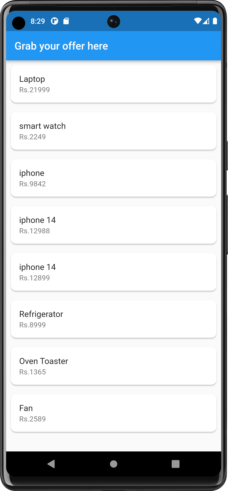
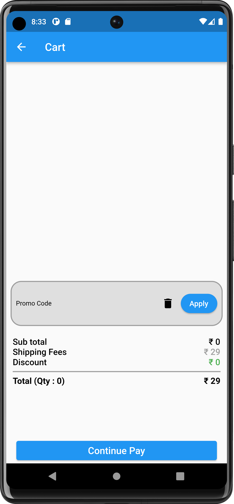
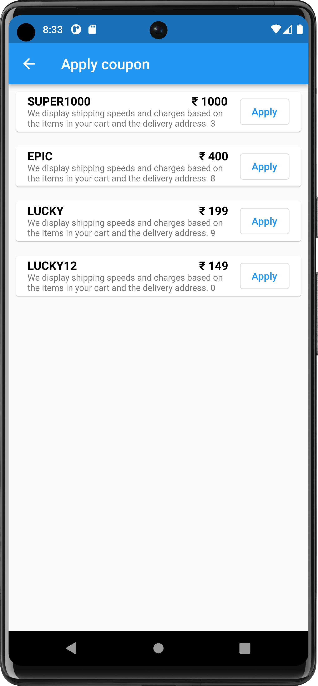

# adv_exam_2

A new Flutter project.
apply a coupon on any product for discounted price pre generate coupons and store it in local db 
and set their limited quantity once a coupon quantity exhausted one can not use that coupon any more and display a proper response.

## Getting Started

This project is a starting point for a Flutter application.

A few resources to get you started if this is your first Flutter project:

- [Lab: Write your first Flutter app](https://docs.flutter.dev/get-started/codelab)
- [Cookbook: Useful Flutter samples](https://docs.flutter.dev/cookbook)

For help getting started with Flutter development, view the
[online documentation](https://docs.flutter.dev/), which offers tutorials,
samples, guidance on mobile development, and a full API reference.
<table>
  <tr>
    <td>
    <td>
  </tr>
   <tr>
    <td>
    <td>
  </tr>

</table>
